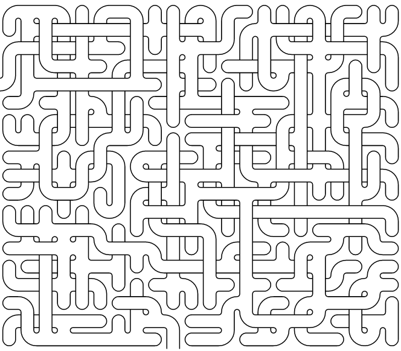
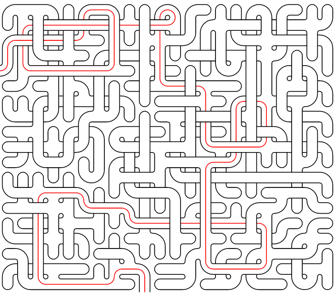

# 编织式迷宫生成器

- [迷宫生成器](#迷宫生成器)
- [解法生成器](#解法生成器)

## 迷宫生成器

``` csharp
public class RectangularWeaveMazeGenerator
{
    // 同步函数
    public RectangularWeaveMazeField Generate(int width,
                                              int height,
                                              double loopFrac,
                                              double crossFrac,
                                              bool longPassages,
                                              bool[][]? mask);
    // 异步函数
    public async Task<RectangularWeaveMazeField> GenerateAsync(int width,
                                                               int height,
                                                               double loopFrac,
                                                               double crossFrac,
                                                               bool longPassages,
                                                               bool[][]? mask);
}
```

### 参数

- **width** 宽度
- **height** 高度
- **loopFrac** 环比例。值越大，迷宫中存在越多条路径可达同一目的地，增加迷宫的"编织感"
- **crossFrac** 交叉比例。值越大，迷宫中越呈现"通道交叉跨越"的编织特征，这是编织式迷宫最核心的视觉特征
- **longPassages** 长通道模式。开启后迷宫看起来通道更长、更"走廊化"；关闭则通道更短、更"迷宫化"

### 返回值

返回生成出的迷宫数据

### 效果



## 解法生成器

``` csharp
public class WeaveMazeSolutionGenerator
{
    // 同步函数
    public WeaveMazeSolution Generate(RectangularWeaveMazeField field);
    // 异步函数
    public async Task<WeaveMazeSolution> GenerateAsync(RectangularWeaveMazeField field);
}
```

### 参数

- **field** 迷宫生成器创建的迷宫数据

### 返回值

返回迷宫的解法数

### 效果

